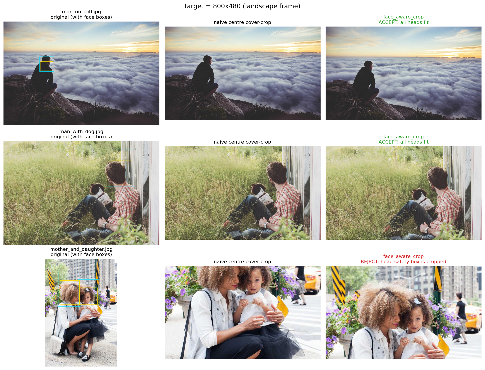

# Frame

A small e-ink photo frame for our home. It pulls from our self-hosted [Immich](https://immich.app/) library, checks the self-hosted [Home Assistant](https://www.home-assistant.io/) to see if anyone is home, and shows a photo on the [PhotoPainter](https://www.waveshare.com/wiki/PhotoPainter) (Waveshare 7.3" 6-colour panel hooked upto a Raspberry Pi Zero 2W) for everyone to enjoy..

<p align="center">  </p>

## Why

Most digital frames either require you to pick and preprocess photos that you put on an SD card or they want to talk to a cloud service like Google Photos. Realistically, you're not going to update the photos more than once a year on the SD card. As for cloud providers, I'd rather not give them access to my cherised memories or let them be held hostage.

It's magical to come home from a day out to immediatly see photos take from the day, or see memories from years ago pop-up within the living space, unconfined by an app on your phone.


It was a fun afternoon project with Claude Code, a bit of experimenting with different ditherhing and post-processing, and then fine tuning the photo picking algorithm. Besides this repo powering my frame, I share it as a reference and to provide inspiration for self-hosting proving that the emergence of these services can produce something that wouldn't have been possible to just hack together in an afternoon with Claude Code otherwise.  

## How it works

`src/display.py` runs every 15 minutes triggered by cron. Each run:

1. Quits if it's between midnight and 7am.
2. Asks Home Assistant whether anyone in `HA_PRESENCE` is home. If not, quits to preserve power and not not strain the e-ink unnecessarily.
3. Picks a random photo from Immich, weighted toward "on this day" memories, favourites, and recent uploads (see `src/lib/immich.py`).
4. Crops around any detected faces, applies post-processing to boost contrast and saturation (which are both lacking in e-ink displays), dithers down to the 6-colour palette, and puches it to the panel.

## Image pipeline

The two choices that matter most are `face_aware_crop` and Atkinson dithering.
`face_aware_crop` resize-crops to fill the frame, then nudges the crop toward
Immich face boxes instead of blindly centering. Atkinson dithering maps the
photo into the Waveshare 6-colour ACeP palette with a good quality/speed tradeoff
on the Pi by relying on numa for compiling the array oprations.. The dither showcases below are nearest-neighbour scaled and quantized
back to the display palette, so the preview does not invent blended colours.

<p align="center">
  
</p>

<p align="center">
  
</p>

<p align="center">
  
</p>

<p align="center">
  
</p>

## Setup

Copy `.env.example` to `.env` and fill it in:

| Variable         | Purpose                                                            || ---------------- | ------------------------------------------------------------------ || `IMMICH_URL`     | Base URL of your Immich server                                     || `IMMICH_API_KEY` | Immich API key (Account Settings, API Keys)                        || `HA_URL`         | Base URL of your Home Assistant instance                           || `HA_TOKEN`       | Home Assistant long-lived access token                             || `HA_PRESENCE`    | Comma-separated entity IDs. Any `home` state triggers a render     || `IMMICH_PEOPLE`  | Default people for `--people` (must match Immich person names)     || `SYNC_TARGET`    | rsync target for `./sync.sh`, e.g. `pi@192.168.0.81:~/frame/`      |

`.env` is gitignored.

Follow [setup](./setup.md) for the full setup.


## Usage

```shpython3 src/display.py                                  # uses IMMICH_PEOPLEpython3 src/display.py --album "Holiday 2025"python3 src/display.py --people "Alice,Bob"python3 src/display.py -o 90                            # portraitpython3 src/display.py --saturation 1.5 --contrast 1.1 --gamma 0.85```

`display.py` only runs on the Pi (it needs SPI). For off-device experimentssee the notebooks below.

## Notebooks

Iterating on the crop and dither pipelines on the Pi is painfully slow (eachcycle is a 12 second refresh), so I do that work in Jupyter against a smalllocal photo pool. Run them with:

```shuv run jupyter lab notebooks/```

- [`notebooks/crop_compare.ipynb`](notebooks/crop_compare.ipynb): face-aware  crop vs. plain centre crop, side-by-side on the photos where they disagree  the most. This is what I used to tune `face_aware_crop` in `src/lib/crop.py`.- [`notebooks/dither_compare.ipynb`](notebooks/dither_compare.ipynb): a handful  of error-diffusion and ordered-dithering algorithms against the 6-colour  ACeP palette, with timing. Atkinson dithering won on a quality vs. speed  trade-off, which is what `src/lib/waveshare_epd/epd7in3e.py` ships.


## Learnings


Honestly, the Pi Zero 2W is overkill for this. It chews through battery if youtry to run untethered, and most of the time it's just sitting idle waiting forthe next cron tick. If I were doing this again for a battery-powered build I'dprobably reach for an ESP32 with deep sleep. Mine stays plugged in, so I haven'tbothered.

I would also give [Inky Impresion](https://shop.pimoroni.com/products/inky-impression?variant=55186435244411) a try with a custom made frame for a larger display and perhaps integrated lights as the e-ink looks a muddled in the in evening lights.

