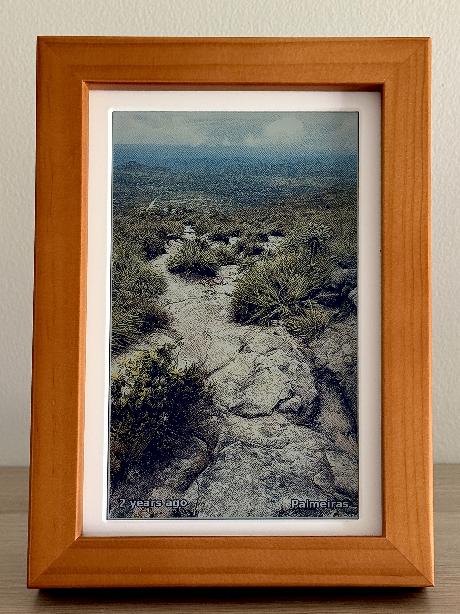
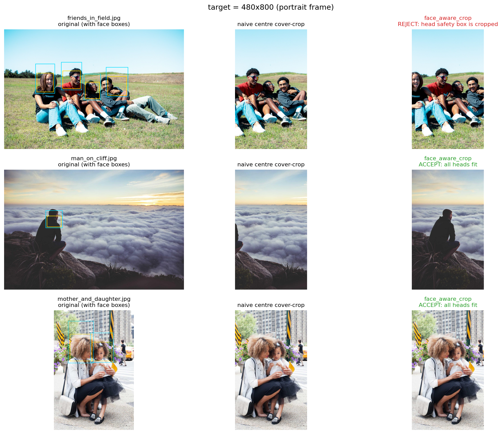
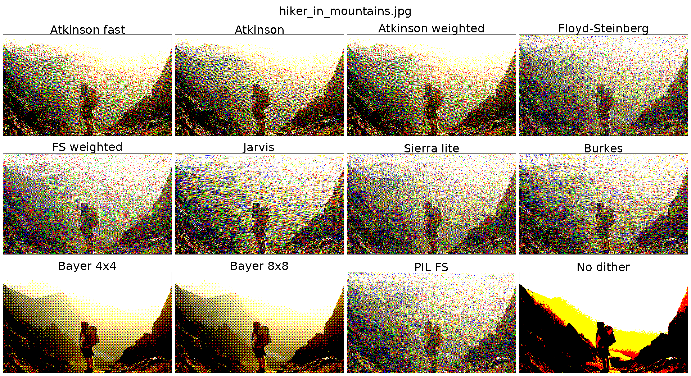

# Frame

A small e-ink photo frame for our home. It pulls from our self-hosted [Immich](https://immich.app/) library, checks the self-hosted [Home Assistant](https://www.home-assistant.io/) to see if anyone is home, and shows a photo on the [PhotoPainter](https://www.waveshare.com/wiki/PhotoPainter) (Waveshare 7.3" 6-colour panel hooked up to a Raspberry Pi Zero 2W) for everyone to enjoy.

<p align="center">  </p>

## Why

Most digital frames either require you to pick and preprocess photos that you put on an SD card or they want to talk to a cloud service like Google Photos. Realistically, you're not going to update the photos more than once a year on the SD card. As for cloud providers, I'd rather not give them access to my cherished memories or let them be held hostage.

It's magical to come home from a day out to immediately see photos taken from the day, or see memories from years ago pop up within the living space, unconfined by an app on your phone.

It was a fun afternoon project with Claude Code, a bit of experimenting with different dithering and post-processing, and then fine tuning the photo picking algorithm. Besides powering my frame, I share this repo as a reference and as inspiration for self-hosting, to show that the combination of these services can produce something that otherwise wouldn't have been possible to hack together so quickly.

## How it works

`src/display.py` runs every 15 minutes triggered by cron. Each run:

1. Quits if it's between midnight and 7am.
2. Asks Home Assistant whether anyone in `HA_PRESENCE` is home. If not, quits to preserve power and not strain the e-ink unnecessarily.
3. Picks a random photo from Immich, weighted toward "on this day" memories, favourites, and recent uploads (see [immich.py](./src/lib/immich.py)).
4. Crops around any detected faces, applies post-processing to boost contrast and saturation (which are both lacking in e-ink displays), dithers down to the 6-colour palette, and pushes it to the panel.

## Image pipeline

The two choices that matter most are `face_aware_crop` and Atkinson dithering.

### Cropping

The frame has one orientation but I didn't want to limit it to only show portrait or landscape photos. So the `face_aware_crop` function resize-crops to fill the frame while keeping all faces within the frame. This can nicely turn a landscape with extra background into a crop that works well on the portrait frame. For finding faces, it relies on the bounding boxes returned by Immich.

See the following example from [crop_compare.ipynb](./notebooks/crop_compare.ipynb) that shows how the head bounding boxes affect the final crop.

<p align="center">
  
</p>

The second issue is the limited 6-colour palette. The intensity of these colours can't be changed like on an LCD panel, they're either shown or not. So to get any legible results, we have to turn to dithering. Turns out, there are many dithering algorithms with wildly different running times. [dither_compare.ipynb](./notebooks/dither_compare.ipynb) shows a comparison between a few.

<p align="center">
  
</p>

Ultimately, I chose Atkinson dithering which seems to keep the highest contrast without too much artifacting. Of course, its performance on the Raspberry Pi was abysmal so the final version relies on numba for compiling the array operations, resulting in a 100x speed improvement.

## Setup

To run the project, copy [src/.env.example](./src/.env.example) to `src/.env` and fill it in:

| Variable         | Purpose                                                        |
| ---------------- | -------------------------------------------------------------- |
| `IMMICH_URL`     | Base URL of your Immich server                                 |
| `IMMICH_API_KEY` | Immich API key (Account Settings, API Keys)                    |
| `HA_URL`         | Base URL of your Home Assistant instance                       |
| `HA_TOKEN`       | Home Assistant long-lived access token                         |
| `HA_PRESENCE`    | Comma-separated entity IDs. Any `home` state triggers a render |
| `IMMICH_PEOPLE`  | Default people for `--people` (must match Immich person names) |
| `SYNC_TARGET`    | rsync target for `./sync.sh`, e.g. `pi@192.168.0.81:~/frame/`  |

`.env` is gitignored.

Follow [setup](./setup.md) for the additional setup steps.

## Usage

The script takes the following options:

```sh
python3 src/display.py  # uses IMMICH_PEOPLE from the .env file
python3 src/display.py --album "Holiday 2025"
python3 src/display.py --people "Alice,Bob"
python3 src/display.py -o 90  # portrait orientation
python3 src/display.py --saturation 1.5 --contrast 1.1 --gamma 0.85  # change preprocessing settings
```

`display.py` only runs on the Pi (it needs SPI). For off-device experiments see the notebooks below.

## Learnings

Honestly, the Pi Zero 2W is overkill for this. It chews through battery if you try to run untethered, and most of the time it's just sitting idle waiting for the next cron tick. If I were doing this again for a battery-powered build I'd probably reach for an ESP32 with deep sleep. Mine stays plugged in, so I haven't bothered.

I would also give [Inky Impression](https://shop.pimoroni.com/products/inky-impression?variant=55186435244411) a try with a custom-made frame for a larger display and perhaps integrated lights, as the e-ink looks a bit muddled in the evening lights. I think a separate light source would be the greatest improvement by far.
